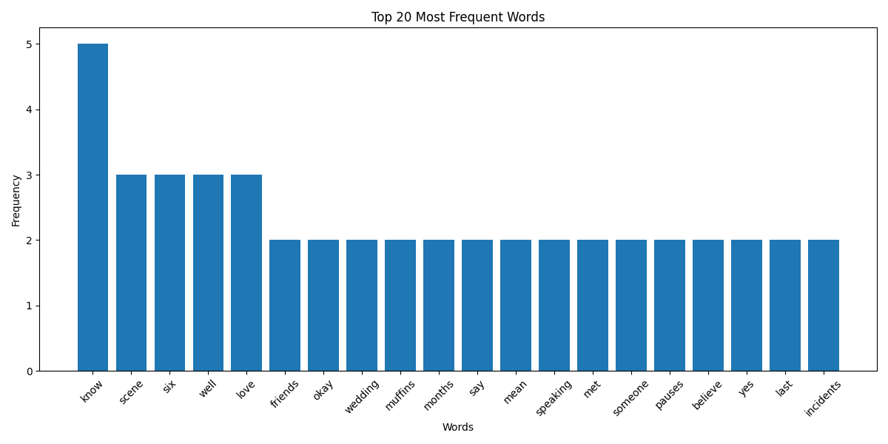

# Text Analysis Tool for Script Files

This program analyzes script files (such as Friends TV show scripts) to perform text processing, generate word frequency statistics, and extract relevant sentences.

## Features

- Tokenizes text into words and sentences
- Removes non-alphabetic tokens, stopwords, character names, and specific postfix words
- Generates a bag of words (BoW) model with word frequencies
- Creates visualizations of the most frequent words
- Extracts sentences containing the most frequent words
- Saves processed data to various output files for further analysis

## Requirements

- Python 3.6+
- Required packages:
  - nltk
  - matplotlib
  - re (standard library)
  - csv (standard library)

## Installation

1. Clone this repository:
   ```
   git clone https://github.com/yourusername/script-text-analysis.git
   cd script-text-analysis
   ```

2. Install the required packages:
   ```
   pip install -r requirements.txt
   ```
   
   Or install them manually:
   ```
   pip install nltk matplotlib
   ```

3. Download the required NLTK resources (the script will do this automatically on first run, but you can also do it manually):
   ```python
   import nltk
   nltk.download('punkt')
   nltk.download('stopwords')
   ```

## Usage

1. Place your text file (e.g., `friends_ep624.txt`) in the same directory as the script.

2. Run the program:
   ```
   python word_processing.py
   ```

3. By default, the program will look for a file named `friends_ep624.txt`. To analyze a different file, modify the `input_file` variable in the script.

## Output Files

The program generates the following output files:

- `w_tokens.txt`: All tokenized words after filtering, one word per line
- `BoW.csv`: Complete bag of words with word frequencies in descending order
- `top_20_words.png`: Bar chart visualization of the 20 most frequent words
- `sentences_with_top20.txt`: Sentences containing any of the top 20 most frequent words
- `all_sentences.txt`: All sentences from the original text (for comparison)

## Customization

You can customize the program by modifying:

- The list of custom stopwords in the `custom_stopwords` set
- The number of top words to analyze (default is 20)
- The input file path

## Example Visualization

The program generates a bar chart showing the 20 most frequent words:



## Comparing Sentence Files

To compare the extracted sentences with the original sentences, you can use a file comparison tool like [Beyond Compare](https://www.scootersoftware.com/).

## Credits

This tool was created for text analysis of TV show scripts, with example files available from [Live in a Box](https://www.livesinabox.com/friends/scripts.shtml).

## License

[MIT License](LICENSE)
